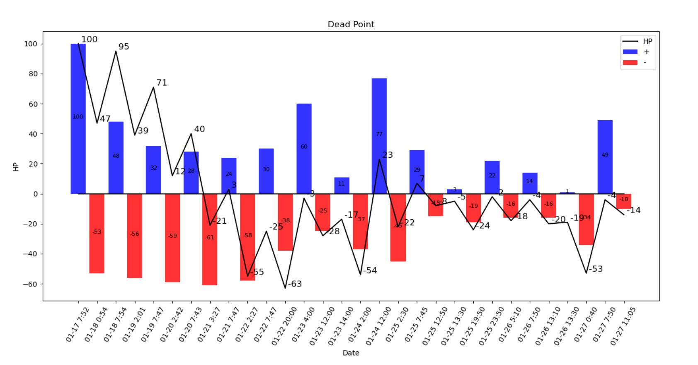

# 猝死计算器
## 通过睡眠时间量化你的HP

```c
Author      :   195
Create time :   2021/1/26
Version     :   1.0

```




## 版本

### v2.0  2021/1/27

实际上人类更需要规律的睡眠。6小时是基础，7小时正常，8小时有修复作用。所以做个加权判断：

- 6小时内打9折
- 满7小时+5
- 满8小时+10
- 满10小时+15


所以还是按连续活动32小时猝死计算：8s = 16w + 10

消耗函数不变，恢复函数加入阶段判断。

### v1.0

首先正常人睡8小时，活动16小时，保持生命平衡：8s = 16w。

假设人类可以满负荷活动32小时猝死，即 100HP = 32w。

w = 25/8 = 3.125 (HP/hour) 

s = 2w = 25/4 = 6.25(HP/hour)


## 使用方法

用msg.py添加数据到msg.txt

运行main.py生成量化图片